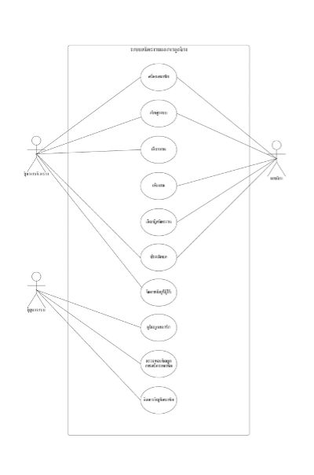

# โครงงานวิชา 06016323 Mobile Device Programming
### โครงงานนี้เป็นส่วนหนึ่งของวิชา การโปรแกรมอุปกรณ์เคลื่อนที่ ของนักศึกษาชั้นปีที่ 3 ภาคเรียนที่ 1/2566
### คณะเทคโนโลยีสารสนเทศ สาขาเทคโนโลยีสารสนเทศ แขนง วิศวกรรมซอฟต์แวร์ 
### สถาบันเทคโนโลยีพระจอมเกล้าเจ้าคุณทหารลาดกระบัง
___
## ผู้จัดทำโครงงาน
1. นายวิชัย คำมงคุณ
2. นายอนพัทย์ นันทนพิบูล


### ชื่อโครงงาน TT-Jobs
> โครงงานนี้เราให้ความสำคัญในการพัฒนาแอปพลิเคชันสำหรับให้ผู้ที่ต้องการหางานพิเศษชั่วคราวและกลุ่มผู้จ้างงานที่ต้องการคนทำงานได้มีช่องทางในการคัดเลือกและค้นหางานชั่วคราวและลูกจ้างชั่วคราวที่เหมาะสม โดยในสังคมปัจจุบันการหารายได้เสริมโดยการรับจ้างทำงานพิเศษก็เป็นที่นิยมมากในกลุ่มนักเรียน นักศึกษา ที่ต้องการลดภาระผู้ปกครอง และรวมถึงคนทั่วไปที่ต้องการรายได้เสริม โดยที่ภาคธุรกิจเองก็มีความต้องการและเปิดโอกาสให้คนกลุ่มนี้ได้เข้ามาทำงานมากขึ้น โดยเฉพราะธุรกิจอาหารและบริการซึ่งเป็นธุรกิจที่ต้องการพนักงานผู้ให้บริการ จำนวนมาก ดังนั้นผู้จัดทำโครงงานจึงมีแนวคิดในการพัฒนาแอปพลิเคชันหางานและลูกจ้างชั่วคราว เพื่อจะช่วยส่งเสริมการหางานและลูกจ้างได้มีประสิทธิภาพมากขึ้นเพราะช่องทางการค้นหางานและลูกจ้างทำได้ง่ายและสดวกมากขึ้นและนำข้อมูลที่ได้จากการใช้งานของผู้ใช้แอพลิเคชันของเรามาวิเคราะห์และนำไปใช้ประโยชน์ในด้านการส่งเสริมการจ้างงานต่อไป
___
### เทคโนโลยีที่ใช้
- React Native (JS)
- Vue JS
- Express JS
- Flask Framework (Python)
- Mysql (database)
- Firebase

### วิธีติดตั้ง
1. สร้าง database โดยใช้คำสั่งใน Database/createTable-ttjobDB.sql run บนโปรแกรม Mysql workbench [MySQL Workbench Tutorial](https://www.youtube.com/watch?v=fUK94jOFwBc)
2. แก้ไขโค้ดในไฟล์ Mobile/ServerMobile/service/connect_database/Database.py <br/>
```
host = "Your host";
user = "Your username";
password = "Your password";
database_name = "Your database";
```
3. แก้ไขโค้ดในไฟล์ Mobile/ServerMobile/service/public_service.py ให้ใส่ Google API KEY ของคุณ
```
api_key = "Your google API key"; # copy your api key => Paste to value at api_key
```
4.  แกไขโค้ดในไฟล์
```
firebaseConfig = {
    'apiKey': "",
    'authDomain': "",
    'projectId': "",
    'storageBucket': "",
    'messagingSenderId': "",
    'appId': "",
    'measurementId': "",
    'serviceAccount': 'service/serviceAccount.json',
    'databaseURL': ""
}

firebase = pyrebase.initialize_app(firebaseConfig)
storage = firebase.storage()
auth = firebase.auth()
user = auth.sign_in_with_email_and_password('your email', 'your password');
```
5.  

## USECASE DIAGRAM

___

## Entity Relationship(ER) Diagram


